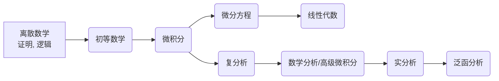

# 网站简介

Easymath-wiki 是由数学系本科学生搭建并维护的一个数学百科全书。我们致力于维护一个能够快速查找到需要的数学知识的百科全书，作为数学系的本科学生，我们将尽可能的结合我们的专业课程知识与部分教材，将我们认为的数学上重要的知识节点以文档的形式展现在大家面前。

当今学界内卷化严重，恶性竞争屡见不鲜，而网络尚未有简洁明了的数学系本科知识教程类网站。本站源于社区，灵感来自于 [OI wiki](https://oi-wiki.org) 与 [CTF wiki](https://ctf-wiki.org)，秉持开源精神，希望能在巩固编辑者自身知识的同时，为遏止恶性竞争，倡导学术本质的探讨乐趣，发扬开源精神出一份力。

此文档在 [Github](https://github.com/Easymath-wiki/Easymath-wiki)上开源，任何人都可以提交自己的修改建议，想要进一步编辑此文档，请联系：admin@easymath-wiki.org。

我们倡导有激情的写作，而不是从一味的死板地照搬课本内容，因为我们认为，这样的写作才是有价值，有色彩，能够给读者带来快速理解，并且引人入胜的。

# 路径推荐

如果你是单纯对数学感兴趣的人，想要拥有学习数学的能力，那么我推荐如下的学习路径

