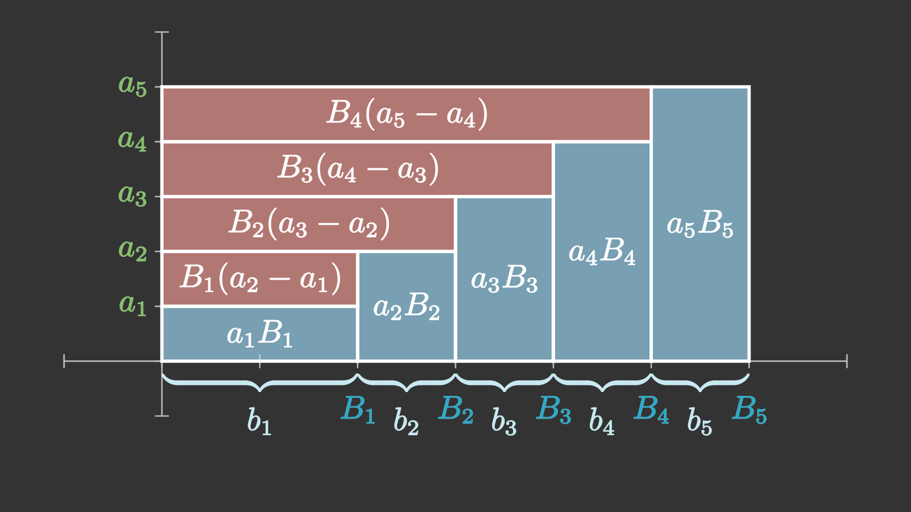

# 数列的求和

\[
    \def\degree{{}^{\circ}}
    \newcommand{\d}{\mathrm{d}}
    \def\e{\mathrm{e}}
    \def\i{\mathrm{i}}
\]

我们先简单了解一下连加号，随后讲述数列的基本求和方法。

求和和不定积分一样，并没有固定的方法。以下我们只是总结了一部分常用的求和方法。

除了这些求和方法以外，还有很多其他的求和方法。甚至，还有很多函数的求和式无法用初等函数或者各种常见的函数表达。

!!! Tip

    连加号和积分实际上存在某种程度的对应，前者是离散的累积，后者是连续的累积。
    
    很多的离散公式，其对应的有一个连续的版本，而离散就对应求和，连续就对应不定积分或定积分。
    
    当有相似的公式时，可以将它们类比记忆。

## 连加号的概念和基本性质

### 连加号的定义

在数学上，若干个数（或其他数学对象）连续相加的表达式

$$
a_m + a_{m+1} + a_{m+2} + \cdots + a_n
$$

（其中$m,n \in \mathbb{Z}$，且$m < n$)非常常见。为了简便，我们通常将它记作：

$$
\sum_{k=m}^n a_k.
$$

其中符号$\sum$称为连加号，实际上就是希腊字母$\Sigma$(Sigma)，$a_k$则表示一般项，而下标中$k$为求和指标，它只是一个辅助的变量（可以类比编程函数的局部变量），标记求和中改变的值。下标$k=m$和上标$n$共同表示$k$从$m$以步长1递增到$n$（也就是，取$m,m+1,m+2,\dots,n$）

只要不与其他变量冲突，辅助变量的字母是任意的，通常取$i,j,k,m$。

!!! Notation

    连加号的上限也可能为无穷大$\infty$：
    
    $$
    \sum_{n=1}^{\infty} (-1)^{n+1} \frac{1}{n}.
    $$
    
    这种情况的连加号表示无穷项相加，是一个**级数**。我们这里只讨论有限项的连加，不考虑无限项相加的情况。

以下是一些连加号的使用举例：

!!! Example

    数列$a_n = n$的前$n$项和为：
    
    $$
    \sum_{i=1}^{n} i = 1 + 2 + \cdots + n.
    $$
    
    二项式定理可以表示为：
    
    $$
    (x + y)^n = \sum_{k = 0}^{n}  \mathrm{C}_n^k x^k y^{n-k}.
    $$
    
    在回归分析中，经过样本点$(x_1,y_1),(x_2,y_2),\dots,(x_n,y_n)$的拟合直线（目标函数使用最小二乘函数）的斜率估计值可以表示为：
    
    $$
    \hat{k} = \frac{\displaystyle \sum_{i=1}^n (x_i - \bar{x}) (y_i - \bar{y})}{\displaystyle \sum_{i=1}^n (x_i - \bar{x})^2 }.
    $$
    
    连加号也不一定表示数的相加。高等代数中线性子空间的和$V_1 + V_2 + \cdots + V_n$也可以表示为
    
    $$
    \sum_{i=1}^n V_i.
    $$

!!! Tip

    很多时候，数学书上的公式为了简便会写成连加号。
    
    但其实，连加号看起来并不是很直观。所以当你感到难以理解时，**应该将连加号展开**，写成**带省略号的加和表达式**。很多时候，只是这样小小的一步，一个表达式瞬间就清晰了很多。

#### 条件求和

有些时候求和号是对满足某种关系的项进行求和，这时候$\sum$下写的就是需要满足的关系。

例如，Vander Monde行列式的公式

$$
D_k = \sum_{i<j} (a_j - a_i) 
$$

便是将所有满足条件$i < j$的项作差再求和。

再如，两个多项式$p(x) = \displaystyle \sum_{k=0}^m a_k x^k$，$q(x) = \displaystyle \sum_{k=0}^n b_k x^k$的乘积的$k$次项的系数可以写为：

$$
c_k = \sum_{i + j = k} a_i b_j.
$$

这里表示将下标之和为$k$的项乘起来，i.e.

$$
c_k = a_0 b_k + a_1 b_{k-1} + a_2 b_{k-2} + \dots + a_k b_0.
$$

### 连加号的基本性质

连加号本质上就是几个数之间加法的简写，所以自然地有以下性质：

#### 可加性

$$
\sum_{k=m}^n (x_k + y_k) = \sum_{k=m}^n x_k + \sum_{k=m}^n y_k .
$$

这条规律由加法的结合律容易看出来，这也是分组求和法的基础。

??? Note "Proof"

    回忆上面的Tip，我们只需要将左边展开写成和式：
    
    $$
    \begin{align}
    \sum_{k=m}^n (x_k + y_k) =& (x_m + y_m) + (x_{m+1} + y_{m+1}) + \cdots + (x_n + y_n)\\
    =& (x_m + x_{m+1} + \cdots + x_n) + (y_m + y_{m+1} + \cdots + y_n)\\
    =& \sum_{k=m}^n x_k + \sum_{k=m}^n y_k.\\
    \end{align}
    $$
    
    其中第二个等号利用了结合律。
    
    这再次印证了上面这句话：<u>当你感到难以理解时，应该将连加号展开，写成带省略号的加和表达式</u>。

#### 一阶齐次性（常数提取）

若$k$是一个常数：

$$
\sum_{i=m}^n k x_i = k \sum_{i=m}^n x_i.
$$

这是乘法分配律的直接推论。

!!! Notation

    可加性和一阶齐次性可以统称为**线性**(linearity)。也就是说，连加号满足以下的性质：
    
    $$
    \sum_{k=m}^n (ax_k + by_k) = a\sum_{k=m}^n x_k + b\sum_{k=m}^n y_k.
    $$
    
    其中$a$和$b$是常数。
    
    或者可以说，连加计算是一个**线性映射**(Linear map)或者**线性泛函**(Linear functional)。

#### 交换次序

$$
\sum_{i=1}^m \sum_{j=1}^n a_{ij} = \sum_{j=1}^n \sum_{i=1}^m a_{ij}
$$

这也是加法交换律和加法结合律的直接推论。

!!! Notation

    对于交换次序这个性质，一种直观的理解就是，表格中的数可以先按列求和、再按行求和，也可以先按行求和、再按列求和，例如：
    
    |            | **第一列** | **第二列** | **第三列** | **行合计** |
    | ---------- | ---------- | ---------- | ---------- | ---------- |
    | **第一行** | 1          | 2          | 3          | 6          |
    | **第二行** | 4          | 5          | 6          | 15         |
    | **第三行** | 7          | 8          | 9          | 24         |
    | **列合计** | 12         | 15         | 18         | 45         |
    
    这里第四行的“列合计”可以看作先按列求和，而第四列的“行合计”可以看作先对行求和，但是汇总后，列合计的三个数之和，也等于行合计的三个数之和。

??? Warning

    研究连加号交换次序的性质时，我们针对的都是**有限**项的求和，要求两个求和指标都是对有限个求和。
    
    <u>这个结论**不能**轻易推广到无限项相加（级数），在级数上未必成立</u>！

## 常数、等差、等比数列的求和

这是三个基本公式。

* 若$a_n = a$($a$为常数)，则$S_n = na$。
* 若$a_n$为等差数列，也就是$a_n = a_1 + d(n - 1)$，则：

$$
\begin{align}
S_n 
=& \frac{(a_1+a_n)n}{2} \\
=& a_1 n + \frac{dn(n-1)}{2} \\
=& \left( a_1 - \frac{d}{2} \right) n + \frac{d}{2} n^2.
\end{align}
$$

* 若$a_n$为等比数列，也就是$a_n = a_1 q^{n-1}$，则：

$$
S_n = \frac{a_1(1-q^n)}{1-q}
$$

第一个公式是显然的，依据就是乘法的定义；而等差、等比两个公式，证明方法将在下面展示。

## 高中常见的求和方法

以下的几种求和方法在高中已经很常见，现在罗列出来供大家参考。

### 倒序相加法/两两组合

倒序相加法针对的是<u>有中心对称点</u>的数列。

当一个数列$\{a_n\}$有中心对称点$(m,s)$时（$m$为整数，或小数部分为$0.5$的有理数），对称位置的两项$a_{m-r},a_{m+r}$便可以凑在一起，这样它们的和就是$a_{m-r} + a_{m+r} = 2s$。

最经典的例子便是**等差数列求和**，我们推理如下：

!!! Notation "等差数列求和公式推导"

    设等差数列$\{a_n\}$的公差为$d$，其前$n$项和为$\{S_n\}$，那么
    
    $$
    S_n = a_1 + a_2 + \cdots + a_n,
    $$
    
    注意到$a_1 + a_n$，$a_2 + a_{n-1}$，$a_3 + a_{n-2}$……都相等，将$S_n$反写一遍，有：
    
    $$
    S_n = a_n + a_{n-1} + \cdots + a_1,
    $$
    
    两式相加，注意对应项有$n$个，得到：
    
    $$
    2 S_n = n(a_1 + a_n),
    $$
    
    这也就是：
    
    $$
    S_n = \frac{(a_1 + a_n)n}{2}.
    $$

除了等差数列以外，再也没有数列的任意前$n$项的图像都是中心对称的了。所以倒序相加法用于其他数列时，基本上只能求出某个特定的和式，而不能求任意$n$的和。

!!! Example "例题"

    1. 求和：$\displaystyle \sum_{k=1}^{89} \sin^2{k\degree}.$ 
    
    ??? Notation "Solution"
    
        注意到函数（通项）$f(x) = \sin^2{x}$关于点$(45\degree,1/2)$中心对称，所以可以使用倒序相加法。
    
        $$
        \begin{align}
        S_n &= \sin^2{1\degree} &+ \sin^2 {2\degree} &+ \cdots + \sin^2{89 \degree}, \\
        S_n &= \sin^2{89\degree} &+ \sin^2 {88\degree} &+ \cdots + \sin^2{1 \degree}; \\
        \end{align}
        $$
    
        两式相加，注意到$\sin^2{\alpha} + \sin^2(90\degree - \alpha) = 1$，所以得到89项1，于是有：
    
        $$
        S_n = \frac{89}{2}.
        $$

!!! Tip

    可以类比定积分：当$f(x)$是关于$(a,f(a))$的中心对称函数时，若$f(x)$在$[a-r,a+r]$可积，那么就有：
    
    $$
    \int_{a-r}^{a+r} f(x) \mathrm{d}x = 2rf(a). 
    $$
    
    它们的几何意义都很显然。
    
    实际上，定积分的这个等式，可以用离散求和方法直接推导。

### 错位相减法

**错位相减法**，就是将数列的和式错开一位进行相减。这种方法主要用于等比数列和形如$(kn+b)q^n$的等差等比数列乘积（一般称为**差比数列**）。

我们利用这种方法推导等比数列求和公式：

!!! Notation "等比数列求和公式推导"

    设等比数列$\{ a_n \}$的公比为$q$，前$n$项和为$S_n$。利用$a_n = a_1 q^{n-1}$，我们可以将$S_n$写为：
    
    $$
    S_n = a_1 + a_1 q + a_1 q^2 + \cdots + a_1 q^{n-2} + a_1 q^{n-1};
    $$
    
    我们注意到，将以上公式乘上$q$后，有很多重复项。在这个思路启发下，我们将上式乘以$q$，得到
    
    $$
    \begin{align}
    S_n &= a_1 + &a_1 q + &a_1 q^2 +& \cdots + & a_1 q^{n-1};\tag{1}\\
    qS_n &= &a_1 q + &a_1 q^2 +& \cdots + & a_1 q^{n-1} + a_1 q^n;\tag{2}\\
    \end{align}
    $$
    
    用$(1)$式减去$(2)$式，得到：
    
    $$
    (1-q) S_n = a_1 - a_1 q^n.
    $$
    
    所以有：
    
    $$
    S_n = \frac{a_1 (1 - q^n)}{1-q}.
    $$
    
    这就是等比数列的求和公式。

在已知等比数列求和公式的基础上，我们可以再利用等比数列对差比数列求和：

!!! Example "例题"

    已知$a_n = n \cdot 2^{n-1}$，求前$n$项和$S_n$。
    
    ??? Notation "Solution"
    
        利用错位相减法。
    
        $$
        \begin{align}
        &S_n = 1 \times 2^0 +& 2 \times 2^1 + \cdots +& n \cdot 2^{n-1}, \tag{1}\\
        &2S_n =& 1 \times 2^1 + \cdots +& (n-1) \cdot 2^{n-1} + n \cdot 2^n; \tag{2}\\
        \end{align}
        $$
    
        $(2) - (1)$得：
    
        $$
        S_n = - ( 2^0 + 2^1 + \cdots + 2^{n-1} ) + n \cdot 2^n;
        $$
    
        利用等比求和公式，将括号内的等比数列求和，整理得到：
    
        $$
        S_n = (n-1) \cdot 2^n + 1
        $$
    
    !!! Tip
    
        这个数列的求和方法<u>不止一种</u>，下面还会出现多次。
    
        一般地，可以推导，对于差比数列$\{ (kn+b)q^{n-1} \}$，利用公式：
    
        $$
        A=\frac{k}{q-1}, B=\frac{b-A}{q-1};
        $$
    
        则数列的前$n$项和可以表示为
        
        $$
        S_n = (An+B)q^n-B.
        $$

### 裂项法

将一个数列的每一项拆成两项之和，并且在求和过程中项与项之间某些部分可以抵消，剩下前面几项和后面几项，或者化为一个简单数列的求和，这种方法就是**裂项法**。

以最典型的数列为例：

!!! Notation "裂项法典例"

    设$a_n = \displaystyle \frac{1}{n(n+1)}$，求数列$\{ a_n \}$的前$n$项和。
    
    **Solution**
    
    将数列$\{ a_n \}$拆为两项：
    
    $$
    a_n = \frac{1}{n(n+1)} = \frac{1}{n} - \frac{1}{n+1},
    $$
    
    那么数列$\{ a_n \}$的前$n$项和为：
    
    $$
    \begin{align}
    S_n &= a_1 + a_2 + a_3 + \cdots + a_n \\
    &= 1 - \frac{1}{2} + \frac{1}{2} - \frac{1}{3} + \frac{1}{3} - \frac{1}{4} + \cdots + \frac{1}{n} - \frac{1}{n+1} \\
    &= 1 - \frac{1}{n+1}.
    \end{align}
    $$

除了将分式拆开，裂项法还有很多其他技巧，例如：

!!! Notation "等比数列求和"

    这里我们也可以用裂项法对等比数列$a_n = a_1 q^{n-1}$求和。
    
    观察到指数函数相邻两项之差可以写为：
    
    $$
    a^{k+1} - a^k = a \cdot a^k - a^k = a^k (a-1),
    $$
    
    所以
    
    $$
    a^k = \frac{a^{k+1} - a^k}{a-1},
    $$
    
    所以可以将等比数列的通项$a_1 q^{n-1}$裂项为：
    
    $$
    a_1 q^{n-1} = \frac{a_1}{q-1}(q^n - q^{n-1}),
    $$
    
    求和得到：
    
    $$
    \begin{align}
    S_n &= a_1 + a_2 + \cdots + a_n \\
    &= \frac{a_1}{q-1} [(q^1 - q^0) + (q^2 - q^1) + \cdots + (q^n - q^{n-1})] \\
    &= \frac{a_1}{q-1} (-q^0 + q^n) \\
    &= \frac{a_1(q^n - 1)}{q-1}.
    \end{align}
    $$
    
    这是等比数列求和公式的另一种推导方法。

!!! Example

    已知$a_n = n \cdot 2^{n-1}$，求前$n$项和$S_n$。

### 分组求和

分组求和的本质，就是利用求和符号的可加性、交换次序，将原数列拆成多个可求和的数列；或者是利用加法结合律，将数列拆成多个子列进行计算（例如分奇偶求和）。

!!! Example

    计算差比数列$\{ n2^{n-1} \}$的前$n$项和。
    
    **Solution**
    
    
嗯，差比数列还可以用分组求和法来求...是不是很神奇awa

    
    设前$n$项和为$S_n$，那么有：
    
    $$
    S_n = 1\times 2^0 + 2\times 2^1 + 3\times 2^2 + \cdots + n\cdot 2^{n-1},
    $$
    
    我们把其中的系数展开，写为这样：
    
    $$
    S_n = 2^0 + (2^1 + 2^1) + (2^2 + 2^2 + 2^2) + \cdots + (\underbrace{2^{n-1} + \cdots + 2^{n-1}}_{n\text{个}}), \tag{*}
    $$
    
    然后我们对数列进行重组，得到：
    
    $$
    \begin{align}
    S_n &= (2^0 + 2^1 + 2^2 + \cdots + 2^{n-1}) \\
    &+ (2^1 + 2^2 + \cdots + 2^{n-1} ) \\
    &+ (2^2 + \cdots + 2^{n-1}) \\
    &+ \cdots \\
    &+ 2^{n-1}, \tag{**}
    \end{align}
    $$
    
    这个过程用一个数表来表示则更加清楚：
    
    $$
    \begin{pmatrix}
    2^0 & 2^1 & 2^2 & \cdots & 2^{n-1} \\
        & 2^1 & 2^2 & \cdots & 2^{n-1} \\
        &     & 2^2 & \cdots & 2^{n-1} \\
        &     &     & \ddots & \vdots  \\
        &     &     &        & 2^{n-1} \\
    \end{pmatrix}
    $$
    
    从$(*)$到$(**)$的过程便可以视为：将上述矩阵从先按列求和，变为了先按行求和。或者，我们也可以用求和符号简记为：
    
    $$
    \sum_{i=1}^n \sum_{j=1}^i 2^{i-1} = \sum_{j=1}^n \sum_{i=j}^n 2^{i-1}; \tag{***}
    $$ 
    
    矩阵中每一行的求和都是一个等比数列求和，我们可以算出第$j$行的和为：
    
    $$
    \sum_{i=j}^n 2^{i-1} = 2^{j-1} \sum_{k=0}^{n-j} 2^k = 2^n -2^{j-1}, 
    $$
    
    再对每一行的和求和，得到：
    
    $$
    \begin{align}
    S_n =& \sum_{j=1}^n 2^n - 2^{j-1} \\
    =& n2^n - 2^n + 1 \\
    =& (n-1)2^n+1.
    \end{align}
    $$
    
    ??? Question "思考"
    
        在等式$(***)$中，我们交换了连加号的顺序，为何与此同时连加号的上下限也改变了？这与前面“交换次序”的性质矛盾吗？
    
        ??? Tip "与重积分的关系"
    
            如果您已经学到二重积分，将连加号的性质对应到微积分中，二次积分可以交换次序：
    
            $$
            \int_0^1 \d x \int_0^x f(x,y) \d y = \int_0^1 \d y \int_y^1 f(x,y) \d x.
            $$
    
            交换次序的时候，其上下限为什么这样改变？这种改变与等式$(***)$中连加号交换顺序有什么关系？

### 转化

## 求和的其他方法

这些方法在高中可能没有直接涉及，但是也是常用的求和方法。

### 导数法

导数法针对的是某些导函数容易求和的特性，将原函数转化为导函数。

注意到这个的结论：如果$f(x) = g(x)$，那么$f'(x) = g'(x)$（即使两者形式不同）。

我们依然以差比数列为例：

!!! Example

    已知$a_n = n \cdot q^{n-1}$，求前$n$项和$S_n$。
    
    Solution
    
    我们可以发现，对于函数$f(x) = x^n$，求导后得到$f'(x) = n x^{n-1}$。也就是说，如果把$x$看作公比，幂函数（等比数列）求导后会变成差比数列。
    
    那么就有：
    
    $$
    (x^1 + x^2 + x^3 + \cdots + x^n)' = 1 + 2x + 3x^2 + \cdots + nx^{n-1};
    $$
    
    又有：
    
    $$
    x^1 + x^2 + \cdots + x^n = \frac{x(1-x^n)}{1-x},
    $$
    
    所以有：
    
    $$
    1 + 2x + 3x^2 + \cdots + nx^{n-1} = \left[ \frac{x(1-x^n)}{1-x} \right]';
    $$
    
    这样，只需求出右边的导数，再将$x=q$代入，就得到了求和结果。
    
    求导得：
    
    $$
    \begin{align}
    & \left[ \frac{x(1-x^n)}{1-x} \right]' \\
    =& \frac{[(1-x^n)+x\cdot(-nx^{n-1})] (1-x)-x(1-x^n)(-1)}{(1-x)^2} \\
    =& \frac{1-x^n-nx^n+nx^{n+1}}{(1-x)^2} \\
    =& \left[ \frac{n}{x-1} - \frac{1}{(x-1)^2} \right] x^n + \frac{1}{(x-1)^2}.
    \end{align}
    $$
    
    所以有：
    
    $$
    S_n = \left[ \frac{n}{q-1} - \frac{1}{(q-1)^2} \right] q^n + \frac{1}{(q-1)^2}.
    $$
    
    可以看到这与前面所说的$(An+B)q^n-B$一致。

一些补充的例题见下：

??? Example "导数法例题"

    * 求数列$\{ (3n+5) \cdot 3^n \}$的前$n$项和。
    
    * 已知
    
    $$
    \sum_{k=1}^n \sin{kx} = \frac{\sin{\displaystyle \frac{nx}{2}}\sin{\displaystyle \frac{(n+1)x}{2}}}{\sin{\displaystyle \frac{x}{2}}}.
    $$
    
    （该公式的推导见下文“三角函数求和”一节）
    
    求数列$a_n = n \cos{nx}$（$x \ne 2k\pi, k\in \mathbb{Z}$）的前$n$项和。
    
    ??? Solution
    
        可以发现$(\sin{nx})' = n\cos{nx}$，所以有：
    
        $$
        \cos{x} + 2\cos{2x} + \cdots + n\cos{nx} = (\sin{x} + \sin{2x} + \cdots + \sin{nx})'.
        $$
    
        利用上面的公式，将括号内的部分求和，于是：
    
        $$
        \sum_{k=1}^n k\cos{kx} =  \left( \frac{\sin{\displaystyle \frac{nx}{2}}\sin{\displaystyle \frac{(n+1)x}{2}}}{\sin{\displaystyle \frac{x}{2}}} \right)'.
        $$
    
        于是求导就有：
    
        $$
        \sum_{k=1}^n k\cos{kx} = \frac{(n+1)\cos{nx} - n\cos{(n+1)x} - 1}{4 \sin^2 \frac{x}{2}}
        $$

### Abel变换

设$\{a_n\},\{b_n\}$是两个数列，$\{B_n\}$是$\{b_n\}$的前$n$项和，那么有：

$$
\sum_{k=1}^n a_k b_k = a_n B_n - \sum_{k=1}^{n-1} B_k (a_{k+1}-a_k).
$$

上述定理称为**阿贝尔变换**(Abel transformation)，也称该公式为**分部求和公式**。

!!! Notation "Abel变换的推导或证明"

    不妨记$B_0 = 0$，于是对任意正整数$n$，都满足$b_n = B_n - B_{n-1}$。
    
    所以
    
    $$
    \begin{align}
    \sum_{k=1}^n a_k b_k
    =& \sum_{k=1}^n a_k (B_k - B_{k-1}) \\
    =& \sum_{k=1}^n (a_k B_k - a_k B_{k-1}) \\
    =& \sum_{k=1}^n a_k B_k - \sum_{k=1}^n a_k B_{k-1} \\
    =& a_n B_n + \sum_{k=1}^{n-1} a_k B_k - \sum_{k=1}^n a_k B_{k-1} \\
    =& a_n B_n + \sum_{k=1}^{n-1} a_k B_k - \sum_{k=2}^n a_k B_{k-1} + a_1 B_0 \\
    =& a_n B_n + \sum_{k=1}^{n-1} a_k B_k - \sum_{k=2}^n a_k B_{k-1} \\
    =& a_n B_n + \sum_{k=1}^{n-1} a_k B_k - \sum_{k=1}^{n-1} a_{k+1} B_{k} \\
    =& a_n B_n - \sum_{k=1}^{n-1} (a_{k+1} - a_k) B_{k}.
    \end{align}
    $$

!!! Tip

    Abel变换可以结合图形的面积进行记忆：
    
    

    （该图片由manim生成）
    
    如图所示，小矩形的面积之和$a_1 b_1 + \cdots + a_n b_n$就等于大矩形$a_n B_n$减去另一部分小矩形之和$B_1 (a_2 - a_1) + \cdots + B_{n-1} (a_n - a_{n-1})$。

!!! Warning

    Abel变换中，第二个连加号的上限是$n-1$。也就是说，这里上限改变了，从$n$变成了$n-1$。
    
    应用Abel变换的时候这里很容易出错，请务必细心。

!!! Tip

    可以发现这个公式和分部积分公式十分相似。如果记$G(x) = \displaystyle \int_a^x g(t) \mathrm{d}t$，那么分部积分公式可以写成：
    
    $$
    \int_a^b f(x)g(x) \mathrm{d}x = f(b)G(b) - \int_a^b G(x)\mathrm{d}f(x), 
    $$
    
    而如果记$\Delta a_k = a_{k+1} - a_k$，Abel变换可以写成：
    
    $$
    \sum_{k=1}^n a_k b_k = a_n B_n - \sum_{k=1}^{n-1} B_k \Delta a_k,
    $$
    
    将积分看作连续的求和，而微分看作微小的差分，那么两者是一致的。
    
    实际上，分部积分公式也可以用分部求和公式来证明。

Abel变换和分部积分公式一元，通常可以将函数降幂。

!!! Example

    求数列$\{n2^{n-1}\}$的前$n$项和。
    
    ??? Solution
    
        设$T_n = \displaystyle \sum_{k=1}^n 2^{k-1}$，则有$T_n = 2^n - 1$。
    
        利用Abel变换得：
    
        $$
        \begin{align}
        &\sum_{k=1}^n k\cdot 2^{k-1}\\
        = & n T_n - \sum_{k=1}^{n-1} T_k \cdot(k+1-k)\\
        = & n T_n -  \sum_{k=1}^{n-1} 2^k - 1\\
        = & n 2^n - n - 2^n - (n - 1)\\
        = & (n-1)2^n+1. \\
        \end{align}
        $$
    
    ??? Tip
    
        求$\{ n^m q^n \}$这类数列的和时，都可以使用Abel变换对幂函数$n^m$逐级降阶。

!!! Example

    求数列$a_n = n^2$的和，也就是计算：
    
    $$
    1^2 + 2^2 + \cdots + n^2.
    $$
    
    ??? Solution
    
        我们要求数列$\{n^2\}$的平方和，可以将它看作两项的乘积$\{n \cdot n\}$，然后利用Abel变换：
    
        $$
        \begin{align}
        \sum_{k=1}^n k \cdot k
        =& n \cdot \frac{n(n+1)}{2} - \sum_{k=1}^{n-1} \frac{k(k+1)}{2}(k+1-k) \\
        =& n \cdot \frac{n(n+1)}{2} - \sum_{k=1}^{n-1} \frac{k(k+1)}{2} \\
        =& \frac{n^2(n+1)}{2} - \sum_{k=1}^{n-1} \frac{k^2}{2} - \sum_{k=1}^{n-1} \frac{k}{2}; \\
        \end{align}
        $$
    
        到这里以后，我们注意到方程的两边都有$\sum k^2$一项，我们可以想办法把右边的一项移到等号左边。两者上限不同，但是给方程右边再补上$n^2/2$一项，就可以把上限凑成一样的了。我们在等号右边加上$n^2/2$再减去$n^2/2$，得到：
    
        $$
        \begin{align}
        \sum_{k=1}^n k \cdot k
        =& \frac{n^2(n+1)}{2} - \sum_{k=1}^{n-1} \frac{k^2}{2} - \frac{n^2}{2} - \sum_{k=1}^{n-1} \frac{k}{2} + \frac{n^2}{2} \\
        =& \frac{n^2(n+1)}{2} - \left(\sum_{k=1}^{n-1} \frac{k^2}{2} + \frac{n^2}{2}\right) - \sum_{k=1}^{n-1} \frac{k}{2} + \frac{n^2}{2} \\
        =& \frac{n^2(n+1)}{2} - \sum_{k=1}^{n} \frac{k^2}{2} - \sum_{k=1}^{n-1} \frac{k}{2} + \frac{n^2}{2} \\
        \end{align};
        $$
    
        这样上限一样了，于是把$\sum k^2/2$移到右边得到：
    
        $$
        \frac{3}{2} \sum_{k=1}^n k^2 = \frac{n^2(n+1)}{2} - \sum_{k=1}^{n-1} \frac{k}{2} + \frac{n^2}{2};
        $$
    
        将右边通分、整理就得到了：
    
        $$
        \frac{3}{2} \sum_{k=1}^n k^2 = \frac{n(n+1)(2n+1)}{4};
        $$
    
        所以，这个数列的和
    
        $$
        \sum_{k=1}^n k^2 = \frac{n(n+1)(2n+1)}{6}.
        $$
    
        以上就是平方和公式的一种推导方法。
    
    ??? Tip
        
        这种求和方法类似于分部积分法中的函数再现。
        
        利用Abel变换求和的过程中如果出现再现的函数，只要它们在等号左右两边的系数不同，并且可以凑成相同的上限，就可以移到等号同一侧。
    
        类似地，求$1^m+2^m+\cdots+n^m$的时候，都可以用这种方法进行降次。

## 特殊求和数列

### 三角函数求和 {:#summation_of_tri}

三角函数的典型求和式就是：

$$
\sum_{k=1}^n \sin{kx} = \frac{\sin{\displaystyle \frac{nx}{2}}\sin{\displaystyle \frac{(n+1)x}{2}}}{\sin{\displaystyle \frac{x}{2}}};
$$

$$
\sum_{k=1}^n \cos{kx} = \frac{\sin{\displaystyle\frac{(n+1)x}{2}} \cos{\displaystyle\frac{nx}{2}}}{\sin{\displaystyle\frac{x}{2}} }.
$$

!!! Notation "求和式的推导"

    这种推导方法可以看作是一种另类的裂项法。
    
    我们先推导第一个，设
    
    $$
    S_n = \sin{x} + \sin{2x} + \cdots + \sin{nx},
    $$
    
    和式乘上$\sin(x/2)$，利用[积化和差公式](/初等数学/三角函数与反三角函数/02三角公式/#pts)
    
    $$
    \sin{x}\sin{y} = \frac{1}{2} [\cos{(x-y)} - \cos{(x+y)}]
    $$
    
    可以将该式凑出可以裂项的部分：
    
    $$
    \begin{align}
    &\sin{\frac{x}{2}} \cdot S_n \\
    =& \sin{\frac{x}{2}} (\sin{x} + \sin{2x} + \cdots + \sin{nx})\\
    =& \sin{\frac{x}{2}}\sin{x} + \sin{\frac{x}{2}}\sin{2x} + \cdots + \sin{\frac{x}{2}\sin{nx}} \\
    =& \frac{1}{2}\left[
        \cos{\left(\frac{x}{2}-x\right)}-\cos{\left(\frac{x}{2}+x\right)}
    \right] + \frac{1}{2}\left[
        \cos{\left(\frac{x}{2}-2x\right)}-\cos{\left(\frac{x}{2}+2x\right)}
    \right] + \cdots + \frac{1}{2}\left[
        \cos{\left(\frac{x}{2}-nx\right)}-\cos{\left(\frac{x}{2}+nx\right)}
    \right] \\
    =& \frac{1}{2} \left[ \cos{\left(-\frac{x}{2}\right)} - \cos{\left(\frac{3x}{2}\right)} + \cos{\left(-\frac{3x}{2}\right)} - \cos{\left(\frac{5x}{2}\right)} + \cdots + \cos{\left(-\frac{2n-1}{2}x\right)} - \cos{\left(\frac{2n+1}{2}x\right)} \right] \\
    =& \frac{1}{2} \left[ \cos{\left(\frac{x}{2}\right)} - \cos{\left(\frac{3x}{2}\right)} + \cos{\left(\frac{3x}{2}\right)} - \cos{\left(\frac{5x}{2}\right)} + \cdots + \cos{\left(\frac{2n-1}{2}x\right)} - \cos{\left(\frac{2n+1}{2}x\right)} \right] \\
    =& \frac{1}{2} \left[ \cos{\left(\frac{x}{2}\right)}- \cos{\left(\frac{2n+1}{2}x\right)} \right]
    \end{align}
    $$
    
    再利用[和差化积公式](/初等数学/三角函数与反三角函数/02三角公式/#stp)
    
    $$
    \cos{x} - \cos{y} = -2\sin{\frac{x+y}{2}}\sin{\frac{x-y}{2}}
    $$
    
    将等式右边继续变形：
    
    $$
    \begin{align}
    &\sin{\frac{x}{2}} \cdot S_n \\
    =& \frac{1}{2} \left[ \cos{\left(\frac{x}{2}\right)}- \cos{\left(\frac{2n+1}{2}x\right)} \right] \\
    =& -\sin{\frac{\frac{x}{2} + \frac{2n+1}{2}x}{2}}\sin{\frac{\frac{x}{2} - \frac{2n+1}{2}x}{2}} \\
    =& -\sin{\frac{n+1}{2}x}\sin{-\frac{nx}{2}} \\
    =& \sin{\frac{n+1}{2}x}\sin{\frac{nx}{2}}
    \end{align}
    $$
    
    所以最后得到：
    
    $$
    \sum_{k=1}^n \sin{kx} = \frac{\sin{\displaystyle \frac{nx}{2}}\sin{\displaystyle \frac{(n+1)x}{2}}}{\sin{\displaystyle \frac{x}{2}}}.
    $$

!!! Exercise

    类比上述方法，推导第二个等式。
    
    ??? Tip "提示"
    
        依然给每一项乘上$\sin{(x/2)}$，然后利用和差化积公式
    
        $$
        \sin{x}\cos{y} = \frac{1}{2}[\sin{(x+y)} + \sin{(x-y)}].
        $$

??? Notation "利用复数进行推导"

    根据Euler公式$\e^{\i x} = \cos{x} + i\sin{x}$，指数函数和三角函数可以相互转换。因此我们也可以先求指数函数的和，再利用复数求三角函数。
    
    设
    
    $$
    E_n = {\e}^{\i x} + {\e}^{2\i x} + \cdots + {\e}^{n\i x},
    $$
    
    并设
    
    $$
    S_n = \sum_{k=1}^n \sin{kx}, C_n = \sum_{k=1}^n \cos{kx};
    $$
    
    根据等比数列求和公式，容易求得
    
    $$
    \begin{align}
    E_n &= {\e}^{\i x} + ({\e}^{\i x})^2 + \cdots + ({\e}^{\i x})^n \\
    &= \frac{1 - {\e}^{(n+1)x\i}}{1 - {\e}^{x\i}} \\
    &= \frac{1 - \cos{(n+1)x} + \i \sin{(n+1)x}}{1 - \cos{x} + \i\sin{x} },
    \end{align}
    $$
    
    化简得：
    
    $$
    E_n = \csc{\frac{x}{2}} \sin{\frac{(n+1)x}{2}} 
    \left( \cos{\frac{nx}{2}} + \i \sin{\frac{nx}{2}} \right).
    $$
    
    而另一方面，由Euler公式，有：
    
    $$
    \begin{align}
    E_n =& {\e}^{\i x} + {\e}^{2\i x} + \cdots + {\e}^{n\i x} \\
    =& \cos{x} + \i \sin{x} + \cos{2x} + \i \sin{2x} + \cdots + \cos{nx} + \i\sin{nx} \\
    =& (\cos{x} + \cos{2x} + \cdots + \cos{nx}) + \i (\sin{x} + \sin{2x} + \cdots + \sin{nx}) \\
    =& C_n + \i S_n,
    \end{align}
    $$
    
    也就有：
    
    $$
    C_n + \i S_n = \csc{\frac{x}{2}} \sin{\frac{(n+1)x}{2}} 
    \left( \cos{\frac{nx}{2}} + \i \sin{\frac{nx}{2}} \right)
    $$
    
    所以$C_n$和$S_n$分别对应了指数函数的实部和虚部。对上式取实部得：
    
    $$
    C_n = \csc{\frac{x}{2}} \sin{\frac{(n+1)x}{2}} \cos{\frac{nx}{2}}; \tag{1}
    $$
    
    取虚部得
    
    $$
    S_n = \csc{\frac{x}{2}} \sin{\frac{(n+1)x}{2}} \sin{\frac{nx}{2}}; \tag{2}
    $$
    
    方程$(1),(2)$就是三角函数的求和公式。

### 组合数相关

